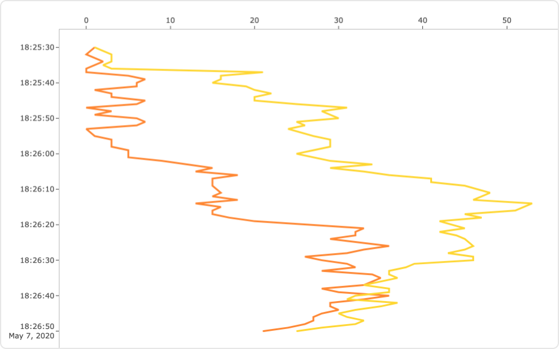

# Vertical Line Chart Mod for Spotfire®

Allows visualization of vertically oriented axis instead of horizontally oriented axis by displaying multiple variables using the visualization Y-axis as the category axis, and the X-axis as the value axis. This is the opposite orientation to a standard Spotfire line chart.

One particularly useful use case for this chart is to visualize well metrics in a vertical orientation matching the depth of the well being analyzed.

## Installation & Use

[Download latest version](https://github.com/spotfiresoftware/spotfire-mod-verticalline/releases)

The [Wiki](https://github.com/spotfiresoftware/spotfire-mod-verticalline/wiki) contains step-by-step instruction on how to install and use this Mod in Spotfire®.

## Building the Project

In a terminal window:
- `npm install`
- `npm start`

## About Mods for Spotfire®
-   [Spotfire Community Exchange](https://community.spotfire.com/files/): A safe and trusted place to discover ready-to-use Mods
-   [Developer documentation](https://spotfiresoftware.github.io/spotfire-mods/docs/): Introduction and tutorials for Mods developers
-   [Mods examples](https://github.com/TIBCOSoftware/spotfire-mods/): A public repository for examples projects
